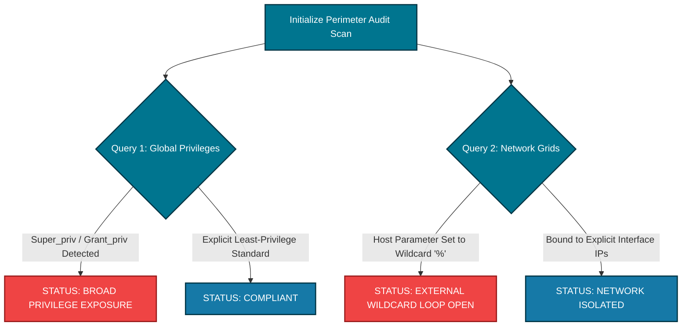

# 🛡️ Database Privilege Auditor (VaultMedia Administrative Guardrail)

An enterprise-tier infrastructure compliance utility designed to interrogate relational backend database nodes (MySQL/MariaDB) hosting user authentication tables, cloud-sharing access records, and creative intellectual property perimeters.

---

## 📊 Automated Risk Architecture Mapping
Independent media systems and record labels frequently suffer critical breaches not from raw network intrusions, but from overly permissive account configurations. This automation engine establishes a direct compliance audit against the target data directory, exposing internal access traps before malicious lateral mobility can initiate.



---

## 🧰 Core Technical Capabilities
*   **Global Superuser Interrogation:** Scans core administration registries to isolate hidden accounts possessing master-level data deletion and creation privileges.
*   **Network Interface Boundary Check:** Pinpoints dangerous wildcard mapping structures (`%`) that allow remote threat actors to attempt authentication loops from any external IP address on the public internet.

---

## 🚀 Execution Profile Syntax
Execute the audit script using standard terminal parameter definitions:
```bash
python3 db_privilege_audit.py -H [TARGET_IP] -u [DB_USER] -p [PASSWORD]
```
